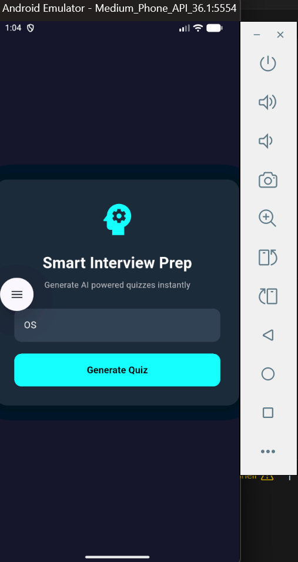
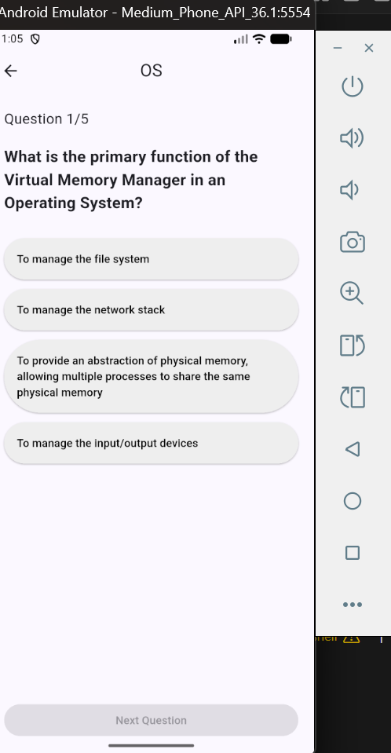
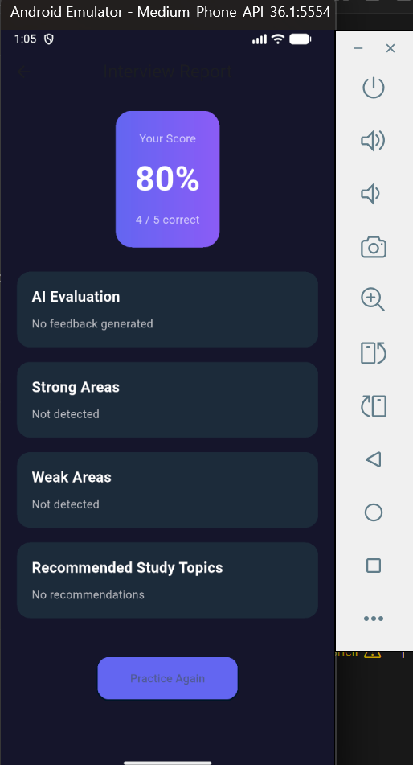

# 🚀 Smart Interview App

AI-powered full-stack interview preparation app.

---

## ✨ Features

- Topic-based quiz generation
- AI-generated interview questions
- Instant scoring
- Performance dashboard

---

## 🛠 Tech Stack

- Flutter (Frontend)
- Node.js + Express (Backend)
- Groq LLM API
- MongoDB

---

## 📱 Screenshots

### Home Screen

- Enter topic (e.g., OS, DBMS)
- Generate AI-powered quiz instantly
### Quiz Screen

- Clean MCQ layout
- Smooth navigation
- Real interview-style questions
### Report Screen

- Score percentage display
- Strong & Weak areas
- AI evaluation section
- Recommended study topics
---

## ⚙️ Run Backend

```bash
cd backend
npm install
```

Create `.env` file:

```
GROQ_API_KEY=your_key
MONGO_URI=your_uri
PORT=5000
```

Then:

```bash
npm run dev
```


## 📱 Run Flutter

```bash
cd smart_interview_app
flutter pub get
flutter run
```
---

## 🚀 Future Improvements

- AI-based weak area detection
- Resume-based question generation
- Timed mock interviews
- Leaderboard system
- Deployment (Render / Railway / Firebase)
---
